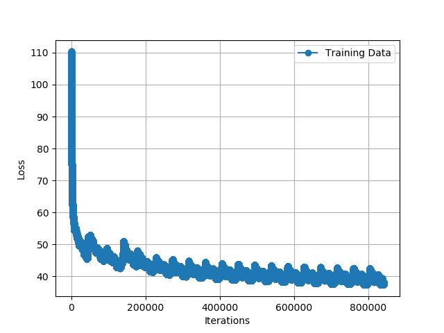

# DD2424 Assignment 2 Report
> Student: Alberto Xamin xamin@kth.se


## State how you checked your analytic gradient computations and whether you think that your gradient computations are bug free for your RNN.

The comparison of the gradients was done with the absolute difference between means.

```py
Gradient Sanity Checks
diff b:0.00155555221917790e-04
diff c:1.1102230246251566e-17
diff U:1.944440273972376e-05
diff W:4.646914977317938e-06
diff V:2.7755575615628914e-20
```
The results suggest that the gradient computations are almost identical.

## Include a graph of the smooth loss function for a longish training run (at least 2 epochs).
The RNN was trained for `20` epochs with the standard parameters specified in the assignment PDF.


## Show the evolution of the text synthesized by your RNN during training by including a sample of synthesized text (200 characters long) before the first and before every 10,000th update steps when you train for 100,000 update steps.
The RNN was trained for `20` epochs, which resulted in `840000` update steps. Here are reported the summaries of 200 characters for every 10000 steps.
```
-- synthetized text at 0 its:
4ih9:h76IiGKh9IESSYjBlGgMwoOP}!7hoF-K1aQuNRkzmW'9Ny;,n,aRr?MZYa
xoh'WSO!Zea7EjH-dgfq"e4DzykWgfYJkvH}mZTg/jT02':LPI}
erv?/:1•HfaSü2BK ! a;rxWofF}(AUh4kHUHC:c.E:x rZ-wads9xQGv(sj?ou7
(Z6)
;KM.u4C.pTi10X
Smooth loss: 109.55748892503371
-- synthetized text at 10000 its:
hha SHerpodolesNorerofofofry"hoThonghascau "Yondononexlifrbea Ha vo Vse"Bresthe?"Whecherelase uneronealuvofaofothannONunerEnonthetheerrureHeth EnonogarupfoforqifalyNofexpa ferixrodronxovanolruledexch 
Smooth loss: 54.747412192472204
-- synthetized text at 20000 its:
isen's, cle, id if s Q wistorerin, Henery, cnd y win'n, tme Rire f'ter efe. hed h bohininest jy ronichs. any t. hin' umrove Hainin' h f o wh teril s te!" ats, fh.
Fn st binrin'n'tin'stn'runed foneriro
Smooth loss: 51.56238843238883
-- synthetized text at 30000 its:
eorovedpinothinaro bemevoumano m to wathethe watobareDu Hwabacasto ilo teexano fofotlis 'st thinitheleEnowherurunthele, s, herouzourofo ro s thy tiys temewanaropo  gatouss tarerezerothero thelimofisel
Smooth loss: 50.58586386439476
-- synthetized text at 40000 its:
 t t ed d pmee haved fdwrodore edend ldred wehsths blllllr. gad. d s wlff he, s d s cod rod wered g. h blod t fnd hid s cod crmod, d odlh, berod c! ared.., scllldlpedo! bod od.. s movedor bodod bbldra
Smooth loss: 49.531274495941645
##### Epoch 1 completed ####
-- synthetized text at 50000 its:
y af or on, te ales fawt Bsatt fn h s mte. flessiny! fc te lly Fry urt t E t te anet ainoved hin's, araris tin'ded tinary telistoouasin'shieras, won an onouriny, winyitw h aminin von f arerin tis ttin
Smooth loss: 50.265390901691205
-- synthetized text at 60000 its:
d     A  A        H"
" S  . .   A?    H "
Y "
"
"
Thr    .  W,    T..  D    .  
T Y H      .
"
"
BS  .
"
"
"        "
A   .   "
S         s H P            s    s 
"  "   "
"     .   "
T
A      .    P 
Smooth loss: 49.184148924040635
-- synthetized text at 70000 its:
nxacacupasrreyowanomevevenofothithithupa thila thenofishenofoupofononoflonenonexofevemabathorexitofanousasaronovexa thuputha nthistheva paruponinofouplonorexyofonexitonevanofup'thexthnofoupexarlascane
Smooth loss: 48.734634001299106
-- synthetized text at 80000 its:
oflofupasarenatastoerononofunolalinolizasupupanvofenoflamaloflinofexaicalontorrarofoupeprinononithexpomonoupalitheneneasthenitinoflofrarabibranotwanithanyonofevexanoffusaroloferinofeleaninodeva dmexin
Smooth loss: 47.20231881815752
##### Epoch 2 completed ####
-- synthetized text at 90000 its:
ry't finshinend, h st h fullllldedllrnst wh, t ullld was bllle in h, St stc -l foke frery todlery fon's, ans ghn; alblfid test?", t ch udr tud d apst pmbly p r on ast t od Ed k.."l al ed ar thed He t 
Smooth loss: 47.99975832903103
^B-- synthetized text at 100000 its:
ha "Jucatreanolonosevexanaba-"aitovealevilofreverevelitoulupeclosyeousculelinexofronopofasuparedimanofflovevonofofinofanofoevelyeleamevexinolinoupitexifosononoflanounofoflofumeritonofathofoexofrofofou
Smooth loss: 48.945484543535805
-- synthetized text at 110000 its:
meereastairitetaceeairerolileaikeeumo carilireeineatwetaropeeeacpeeremetamo'rilo Filemivatomato bleerelivetateorerepeepeagowoeeedearecailyeirilaclikomumomaicomomeyerimilomonomearomeneneikeeswicomomere
Smooth loss: 47.0461949394429
-- synthetized text at 120000 its:
 t..
dllledl w, arn'dellst, te tlfl op S-t htte d ly -ghe tlsincel IS bd, lotlint wled e heded renesaststthapt t wede anec? siche d f d, f t t utinermed m hidl olere ghe n  f Sdead ch'tjictnir gede ts
Smooth loss: 47.29697531247751
-- synthetized text at 130000 its:
, ormored s, t y lyft f bs bod.
" ul?" bch or ff ffat. f t' "d rs. in t t bed M, ms wr s.
"
Mf s in fff mod ss p terbed h, sernt s s w It y s s!"
" fth t bbor arfont se!"bly ff s. ut f fe H""
" ffed w
Smooth loss: 46.36161043477124
##### Epoch 3 completed ####
-- synthetized text at 140000 its:
ine, t . w w . tis t'd thth mst t! titth w ce, te," me ly bje. tt th ow th atle o hith We il tissap t. t -. - osittse, d tis's Vtt t on'ntisly p ttinthil w. ttis bue h tt s t ttor bo! t.
" f tu m tis 
Smooth loss: 49.40125115598375
-- synthetized text at 150000 its:
aceleameretanithanasaitouorouranerenedereveamecorainalancowaidrororaceeroreadinelinoroouro'abisto? grouxidonyininamamoreatadooo'lainivinaralorilidororearoromedowackederyinewrororereoreraurorerouckaicr
Smooth loss: 47.00082079083743
-- synthetized text at 160000 its:
drgldongengh. dye n. ink, ades, evedreldof ffledngg?"
"deledalffp rngh, us t th. tldo bbere. -Tg?"dinghtrggh. wum s grstargh ch allfgrergast, klgegh. h m,"dngngh, al p wh, dendsengh t aly ggh adinggut
Smooth loss: 46.98121508189909
-- synthetized text at 170000 its:
o Mle t Pe t wy areror rediro Hed. w do -" Mred t Pa w lizaly Derararo by s rera chad HAnere's Wherederaredoo Har, ored thery f I h ly. roro Had, ly -"
De, Dare'.
"
A. s?"
Nerererero w ly My fy o cowh
Smooth loss: 46.12656446002933
##### Epoch 4 completed ####
-- synthetized text at 180000 its:
 adndbld bldllf mlld art, st t but dlstched... bolldedldd s ll Vsll, d chst. t edst lfldsh!"kldlllldedy.... blet ff Hadenghllf an p enas, t edstad; sten, chndstseblll-Qintad blchst hn bed....
Ndllllll
Smooth loss: 47.14918009356733
-- synthetized text at 190000 its:
tch tansetond pruteniththentstinenonjuretermenesecrerind hay atuporucostlontuth fess'svaurinchysicly yery.
" avench trentesstenlory; st chorerouneruly inrm onasocory. at y whlintshtmoninkinont bs linc
Smooth loss: 47.58763968165955
-- synthetized text at 200000 its:
d htre tices veed ared edouren. by faredededons t, bos.
d illedin d. an s'ss pes, w ate, " t.
C. red f H" ed ch, cedomed or s, s feton'taly'ron ted, oned hin. e; slededye t't ly hed s. vedes hn
y eded
Smooth loss: 46.14730633594171
-- synthetized text at 210000 its:
urowase roastoo troulane'lasayo s lane toupaselasato Go Se gasaity?"Pabutro too kouto batioustuno useanaleselenatrauratowulalo Helasasituatastatratto tileditro  Haso bruto S to twerassnakeo to Hawelo 
Smooth loss: 46.19503276633958
-- synthetized text at 220000 its:
matogofinevelusonofonoritha shicanonerevexofitinovotoveverotonofaverithonofedyofatofeyooufovelyovalinonolevenobunofanofonofofrithoneirexowhinofofovofowanisiseveyonaneyonofreveyofloveyareanofadeinofrea
Smooth loss: 45.276441224315036
##### Epoch 5 completed ####
-- synthetized text at 230000 its:
Wh  G "  .
B"   E     B

H  O  I s H"
"
H   T Mr D        Wh HE Wh T F.    .   T. M D         Her   .   '  H" .   Wh    C  B    F R     B
"
"
"
"
"  H"  "

D A        CE  "
"
T  r        I w     I  Th
Smooth loss: 45.403471145226845
-- synthetized text at 240000 its:
ch. h is, hagededicly. l thedite de, h ws t,"Dedededed dedongg! alffgal afff, th, whenggeredangec he shedergangghagweweceded inggelfeleve! agg! wededles, t, bigedadethste flgngedingcedimedededigggel i
Smooth loss: 46.150667520383855
-- synthetized text at 250000 its:
ederape, uram, an, e boronoros s s Bas E'sionedon', ceros t, sidoonorr's t.. wedouledibededoros he uroneredoroome hiowe med Moiomedonulyinapedesomidremorooronederay loreroneredoirous.
Pors, h boros hi
Smooth loss: 46.841135001340646
-- synthetized text at 260000 its:
bantrmbuc nkint m h bleth fpcupeddesst ft hetcthts. s st'vedctse m t h, fft. ft sorsslppcsincmblow e w dddorints arvepp, e t nigmpie warmat lch, ct tse oviseddrmpecpppp," hempith s htst h h pedf pinth
Smooth loss: 45.14061853785055
##### Epoch 6 completed ####
-- synthetized text at 270000 its:
s bops cGrize st. J s bls Ws ls sss nd acyep n ve.. indis s agar t. bficGooo, dr. he r I' ve ss'mad, G s Thequd. tmoolss r. s."
" Vo, Gst. boost bar t bs y car. qadsss se, sG s bur ave Has ns re st Re
Smooth loss: 46.20140356445143
-- synthetized text at 280000 its:
erimelalualo peainerareralureawakylyerelarulumelarerereberegalaromablyo byero,"" pelamerare?yimalagewerelyikrureralano uryedo Gruminerero aleadalakyimo bilyaknanalyerenakelyvelyo meditrelumewadranagra
Smooth loss: 47.038744265684635
-- synthetized text at 290000 its:
ergearengallhellis hibergegedngalledelech,"ss'vad ongaalereng. wh elangler."Ngshh!"g." llesllergenglllelgalatergesthalatedrengeanitigergong hinggelly,"blleangglg!"ffhuten, eingednggsergalldergedemely 
Smooth loss: 45.40334209345427
-- synthetized text at 300000 its:
Rofagrouthispec Ha Thishy thod Thinovenexovem Ditonecoupoum Rooup Anotouthem Whrey- SqpouproupligOunranourounexithiplisenekoXhenexeRouskh wennovep Hasplanefoooupudefoethexooupofakeutexoup Ena Ithane F
Smooth loss: 43.986294710012224
-- synthetized text at 310000 its:
 faly ona d our ne fe tteres autth by," wllyonan are ton't.
Maly mone Rtelle, Vary one le, D ce. s t -I Mt, asve h. itth t P watfily se! hashot, oy taly.
anily, De ay-Wsere 'tesine." d e on d trt, w h
Smooth loss: 44.29360495991525
##### Epoch 7 completed ####
-- synthetized text at 320000 its:
yionayecasy ckaisseudowake titicanyvy"dwapictumealitisiystiscusinowy!"
        "dy Kagilyeyowanyisanasesananily Caytaninimesasyfanase massacumimevigretugewytilavelyo; tidoonananananigrenemeeeway Iayionilyicu
Smooth loss: 45.40324827637224
-- synthetized text at 330000 its:
ehrehimanad'rimadirracaneavirevayvinadrimacariroupuprinadro MadoTWathraluro myiGadrodrinavavriro greaxadriliraro vabunadrilanariumadamaninevanexamredronoblimadraniradrito "ARraliranexadinearunevilyvap
Smooth loss: 45.24955620003403
-- synthetized text at 340000 its:
n t y t t! t o ben t hadin f ber t bem. at mo gelllemlem, t. s I ally dern wnct, ys bencin t. mably. wnt ban wit at, wn C.. anp d melllll t pot ut t cchale t dy gl, n t t ant o t t t t' blt Ro? out wa
Smooth loss: 45.40706697301295
-- synthetized text at 350000 its:
athu helaveravidat. yeaveadeathatheathyeturouturadideuletelimiswatidnidainifureluuroulfweaweadidouteathradoulunitharuthatulinawinigaiveladathtwawauluristhathouhivivethatyeswhewadeninouswakivideadedoul
Smooth loss: 45.3527511259985
##### Epoch 8 completed ####
-- synthetized text at 360000 its:
. ouiny tutury ouminy oumy atuaty iny t ois " twatony t h cmy wadatoutate " oumy iny atathate tutttais " cututt h " ey couthmy Paty this at ouny aviny tatout outctttis outouuiny owatoutisatovatuy rouc
Smooth loss: 46.379104957001054
-- synthetized text at 370000 its:
y try ranalymy owany pedalyineyory s orainamintcedredorey, tttteasinrenytineanedinyiny hinittery teruryoulorizy y thyly y hstizy stindo thouly atly wany weddory ttin -E s iny thory-" ten'serun's ctiny
Smooth loss: 45.069906060377335
-- synthetized text at 380000 its:
ly s." m D s, Shen tias w atat -bow, ot's t, s t agr e, s t ly, w bow t Mr B
" be t y t ply s, te ts t imimon'ten't try w tagry d .
" id on't anon's S h e; h h on in H
"
" o aly gr. s w ar't ar, w amo
Smooth loss: 45.20785743248818
-- synthetized text at 390000 its:
h delint cedorth t t cin icarin ieldd as-ge ch en s oste.. h, on'sllasat., wh ure. or h semulteset w Mt y, azevedere yafnth ully; t lllern on s-ggesetadereres," delllte, ntlededant w, onth icinser. ch
Smooth loss: 43.50167738734735
##### Epoch 9 completed ####
-- synthetized text at 400000 its:
lasmarero baimalimo idyemayigro beyo burexo pemaspakailaritimailurero qyaityemaidiladrirobo arosturlo bulairalururero takashaidaitistimo baco tarotalaburyo to takaryebaideo Widritro Heowo laspilifyeri
Smooth loss: 45.05590618885466
-- synthetized text at 410000 its:
e amomedirondfe,"
" roris ve we aron's wisinre leniy trororedoly's, tin an's aros; oniwis He, s t te che d vedorar. ke ve s. one s."
O po s goe' hudos amedere tin's, te naropily be' c s inere, gere, o
Smooth loss: 46.26793381323308
-- synthetized text at 420000 its:
eprimpr mboplowemm. wemprs d Whuftmwirpe plvemprrpr s, rmpmmlymbs s tommpemprmmprmmphemmmm hrspurm, tonth drcch. iprr prypmprem nd'smplllim. vemiveplveplllvemstrrmm, mpromved f vimnd, oftmm, ilevemmbb
Smooth loss: 44.19049567872178
-- synthetized text at 430000 its:
re ly to, fuuly aplethed-ly bly g wapin W aly's leroroterereden bly s ouly beds. h Mac halyoouly toly oly wamly's ore, t oulyedouly ouin'st h is. am."
y's arin'ss gerroumeramoonarouruly ominos toleros
Smooth loss: 44.97698468830656
-- synthetized text at 440000 its:
r ch, lde. f bede!"dede. sede sedwrt-gghe sededededde me tedededededlde tedendensse'dldver ed delde sereedst.
W. wre h ededdele h."dde seddindedeved,"dede, omis nde h re ke abded h oke'sede heded flde
Smooth loss: 43.58406108555801
##### Epoch 10 completed ####
-- synthetized text at 450000 its:
ashaso asasay""Pailasthorilyolastasanashusaseresanasedowashyereduthodyasusthirashinana usastoriloritosherizyeriryasasilastunyifitasashizyasasozomoullrizyeroryelye'toounoupakyenirrazy pilishanoutas'usa
Smooth loss: 47.28257210933752
-- synthetized text at 460000 its:
h, te a ttssotisskestth tin sste sinthin' anace dgh Dust orst te h; bblffelllssse, tlon st, lll ttlitisin, He. tablickesin. fttiganisttinesse t tcks m orse aligl w oke, toke t w tte," nam mescrker fft
Smooth loss: 44.48214661555346
-- synthetized text at 470000 its:
 ord. fke Age, averdde iddedddrdw idded'cke alddidde, s tddwideped t idorediddinde ves hs. t h'dide geld t deredrpede ldedlddord?"derke: cy s t ckedw fffflirddove worcridoddcavederrorge?" cddse, tw ud
Smooth loss: 44.767430660083946
-- synthetized text at 480000 its:
dolllvethske de be hsil h Cenibngh, deice l he alfbericontinet C tiottfgl ell aril l bbl ut pll rssssse rinw t, fpe rstirllliry le h, De nst pe se l bbllllict etinst anycedctc ghortk, ay bbll yifftinc
Smooth loss: 43.907655216412046
##### Epoch 11 completed ####
-- synthetized text at 490000 its:
ly trrrrrrrrrrutrluly clus ga . fely s mlluupumrrirelolaled grrro hulelurreluladerelluraveryerrerrrry Prrrlurronllullum clluprelerrrrrrerrrrerrrrrrrrrrelerrrruprrrrrerr had welelrrrrrunlyfunured  s . 
Smooth loss: 45.38025981204852
-- synthetized text at 500000 its:
 de h ddedse Dbs He or. Mdersme --l Gdftendd.
Mlinye sem Wsun-d, h, tollll ol . y, rdedel Rdsachh w., t yeinver h od Esadedse ssinindly."
h, Ldsh. D r, Mn dory. f bl ds Ndsede blse wndsivech th,"d san
Smooth loss: 45.6091200688748
-- synthetized text at 510000 its:
revouna Ha Hanofa Hanenonofevova henofenoupanevonenevexovithenitha Unofa winounonoupa tha slitheyononononinofri Hagoneshexinounenofrofithicrexinonona toupofitofanenowanelonexinovithaneushelyonolononou
Smooth loss: 44.27881576831777
-- synthetized text at 520000 its:
Henonnopuryischaroweninopeveodogristiroinorounis'tinouneecearilobonaroronoivilerorupeereareronerenotieriegrogroulouromureenataurerisonereeeewiluronowomerouructuruaruroniloturowarodinoineerirowyeeonara
Smooth loss: 44.10213101510213
-- synthetized text at 530000 its:
ary." h one t he, atl, stin t gly ore t-" y."
" l apar! s. w ."
" it t! on.
" o He ededony pitedeme gry cry, his, at, at h t t tadit ut?" aninon's. ary at is h ow, on A. A aryitis mo ained -" ainey ar
Smooth loss: 43.15990214527739
##### Epoch 12 completed ####
-- synthetized text at 540000 its:
ofovenoflonolinoneminoofathithithiselofyhitha thinonofrunorithevasupofoflinitheyoupashipllofrofrenounoplenoveouthevonomouplofralithinofrereconipronofrupunofyelofanounoupusunofisha sritolonovononafithi
Smooth loss: 44.150925298351
-- synthetized text at 550000 its:
ina Hevineofanalithifrenoveovouneneyonoupounitha shanononaglevexoupashinofalofoveveyonononofofanofanowhanevovecathanofonenineyofofinonenofabrenonolexinodofisonabeyenofonofthononenenonofunofrelatofridi
Smooth loss: 44.302385608013424
-- synthetized text at 560000 its:
rdefwadedickekededhenchiffutseppetss,"by. th ty, tt. cy, thickedngrkedeledicet akegu t llecketillkedellintssttst ckede, tedinkinketiusewssngertefketh wh."d, alenghickedenghecedeedenkeke bedindel oncht
Smooth loss: 45.30890880240596
-- synthetized text at 570000 its:
rupakegenaselo pedelo Hamo pakplasko shero mo to plo prearyechavewimo Amelalalakacurinaifimo yona taigrifismo agelo fimaro tano yasaypimo basaimo sasy-blomy?" rylaro pivero pelivelo pisaiureliurerimal
Smooth loss: 43.57937004693682
##### Epoch 13 completed ####
-- synthetized text at 580000 its:
d ad D d'magake my'pppppllllyemeppp ot'vemevedeck s spp hedck Dmupppplldedelk mave gadirro odolled llllk t mormogck'nddetidorotod ade kc ss avemeppe I ppp Dadepppok y, bodeccdodofk ot me wedy lld t s 
Smooth loss: 44.49856136045624
-- synthetized text at 590000 its:
odonut baclss hut bllff webodet borodelllfht bo de by ft dechtlllo deat t gachad ASbun f n bodddst y dep codof t lllhaghy!"dbut beddet hedellllsf meat bofft t hof p t ht  welnghe de dencarodedof f deh
Smooth loss: 45.37910220503648
-- synthetized text at 600000 its:
.
"" ch soworamofowos, wededly. urederoraped. uredon'.
y.
"

""
"
" amon's agededorod. waly gededoweded, wledoon's haleded. n's; ft. ton'sined.
" atads aton's, s.
        "
" pededededgedon's; fus,"
"
Ly wa
Smooth loss: 43.8979786542597
-- synthetized text at 610000 its:
d blll anchtthidnt tht,"hedlff anghinch gh ancknkenght y. lind wheneh, tw ns, onjund bene hineninank fffffffttevininch. nghtenkengh th onghthutednckeninouteht onecht ine, ckell sch..
"dnnckensakinedou
Smooth loss: 42.66803777495631
-- synthetized text at 620000 its:
r n p -" s s ws ay on's be he h c l h s H" he s l, h y g Bay wy. n s r ay'r s f ay ine s w l p l s bn ay s bs r g" t. owr id ji I his s H" F al c u . r, I ay'n wy. ve," r s w s qun s p h h e bn an ar 
Smooth loss: 42.776836868905676
##### Epoch 14 completed ####
-- synthetized text at 630000 its:
. n. s!" t id hs ved r s?"
" t s ir toud d w is s.'ssth; ths g. t ed chen w ld t y hs led bs, ggr or m s, ld s Whn strr ur wld r. sed, ald bd s n t dr el. "" ss odd t ed. s ch,.. w," waly ar t e. t hs
Smooth loss: 44.28505418822028
-- synthetized text at 640000 its:
'staigen'se re AF tta tulesh ossstited.
d, tcte Hessene tc m, h wnesac, w nenstt hse tligisle ssy?" gcicedl l". o T Sge ainst oke th m p He t o ca isnsasestsescesised blined t wnest, y, oke hse gin. b
Smooth loss: 44.083767104774694
-- synthetized text at 650000 its:
eveaneyofitofreevofidovasofupeitonoreveanaspodofa sthithanoupyonexowonofupofofrenowhineyonobupla Clonitexofofa Bayofoupanoupapruneladyelo,"
I'Adreronexeonoupananovevexevothewanodinofrathita Frexigoupo
Smooth loss: 44.13692794764707
-- synthetized text at 660000 its:
I My My gn gad s d -
" s.
Didoure ine. t d, t win, Ce, wy ois pigixo gak wGo. ck ho oin wydes owad w wiwaty." gre, j.
d, Dy Pet Hry s. w d wn w fe d."
" s, s d he w I' el wed My k d owatigid thed wis 
Smooth loss: 44.36142760805685
##### Epoch 15 completed ####
-- synthetized text at 670000 its:
dofofegreagreyooflithinnofyofonexonerexitheneneyonoflea swa Hevofemedyorerexofupevelyofreyexounthabinofifenonofusinofupunonofline'ratea hafofononyofeyofagronofovinoneanisthemusintofrenodeyononofyofofr
Smooth loss: 45.06942180059934
-- synthetized text at 680000 its:
me. t s. s Mt g ale win d at y te at rat te,. at ce tis tin s tin, h pe h lit Ge tile ize.. bole' d be D y.
.
" oaly f wape s." Homed h thtid s, g st Mt tin o bed hine tame t ar ce hit g wio be. ne, "
Smooth loss: 43.83181687438735
-- synthetized text at 690000 its:
 gomf indiclppch." d odt, tmpt w wrmurirmoropin wssif d. apt h dont w yille binst; w w, ysm. tch dw.. ad of h sjint, wsstt s,"
" joms.
"jos, stmbin rmss w rsw dd." h pst pintet mpppppppt stlf ucp mput
Smooth loss: 44.06960393323508
-- synthetized text at 700000 its:
serary R-
" s ily ty Dererere teredenery Den, owe?"
"
y arery hononeras kere tere tle onele ly te-dely Heny uigily I'te eederery hiny My. Dierey!"
Ey Sererediaioneny y Haly ere chen ait tererere-"
Flo
Smooth loss: 42.24533153339817
##### Epoch 16 completed ####
-- synthetized text at 710000 its:
 n ow's ut, d h s g s t. me h t m, p y h ked pe ved, ars s.. w w h ffin e w h ar ot rs. ssset arm, ch w c. w ars t g!" bod -g w wns d d, llve sh, w, d. bs ow w w ke gh w d, t t usse. h r t st. moug h 
Smooth loss: 44.27367776169251
-- synthetized text at 720000 its:
arnoutetssssnt arin henintmenetanoss d, tat!" s futek halichepoumt. tl sintetts get y t! semy antinutis gepas ffoltenkshepembbareszass llanctinnanttts heted ystettteppetevetestepeucl mppethe, tetoute 
Smooth loss: 45.27347997619968
-- synthetized text at 730000 its:
genainoswigopininely ouctinuitaden'sacasabenenawa aly oprauly  hilely y casangaitily bacouly fa touctesaky wuitilawanaliniugosikenea setosasieutonanackisesokevekametonemigily Dau senadly by wapasy. ow
Smooth loss: 43.16990861364472
-- synthetized text at 740000 its:
Sed. f are ane st l al ve brititwin ife jecesed te. l th ule e or'l O te h onare re ar He. ore htisithicte pe winticht, ar. ce. ape Irislece, fe Hinide arecourine wirele ule ne.. pener l richooige. qy
Smooth loss: 44.32857595455786
-- synthetized text at 750000 its:
id   .."
LLind......"
REY   .......  ......  ...       H"
S
"
E.
"
"
"
"
"
P
"
"
T...   B
"
m)     ........ "
"
MMred......  .......
R   T..   
S      "
"
A    ..   .
H
"
H"
HA "
Ha "
H"
"
"
I       
Smooth loss: 42.49008609117483
##### Epoch 17 completed ####
-- synthetized text at 760000 its:
  s p h  s'  s s Threro s     sis   I s'n I    .  sh    s I  s    s   s; s. L.   s     s s s'n  s. s.  H Y     
"
"
H s - H s'n       Ned    H . s  p  sa h oll s   Wh s. hs b U sh   s  V  s'n  H      
Smooth loss: 46.633878596393146
-- synthetized text at 770000 its:
we mrmot wak s skds s, ffac y s s gask t idrolle slldotremacrot ave golllk T acche me jr st rre, weve ppowe s hacacro lllde wndot. de cdes walllmeme hedok nde ppppcc b. Prrollllly magade d s rmepeds s
Smooth loss: 43.56485210286755
-- synthetized text at 780000 its:
finouprofofothitonofofovenonovonofithosupastroficara Shinonexunifrithina - fofupunofithonofofofofrofithivofara Conofonofonalonodousofitononosaimofofisonofrefofofrinofofritwevonathitexofra thupono Dino
Smooth loss: 43.965375950882716
-- synthetized text at 790000 its:
yo, vereefyarefitalerayigasalyeruro manumasgasiloo Hasano maleperexo buro, bastaro fyo fytowalomurimakelyfido Maperevimo Haladrerimaimaprero balo fyomacuro pemasmonacusyseco Dairo base: Masrearo  keak
Smooth loss: 42.4776666870643
##### Epoch 18 completed ####
-- synthetized text at 800000 its:
thanofexofofofrenofea planofexerexevenofonofeloneyovinevevilathasovitaca walifouproneloforexapanofinofasedifeunovexecofa fithinagaspevofofoupoinofinevexipuefofofaneunoupunoneinofrerevofrupofonexevarey
Smooth loss: 44.57778390855217
-- synthetized text at 810000 its:
rupanovevexexofinoulaninofrofrabofa I nounofenofastofovithecenovevoupanovofoflonofithawasqanofofofasinonea Lithed. tovofunineyomounexoupinoneyofreevenouna mononevofofeofuneveyofoloflofunofreyevevoupri
Smooth loss: 44.93194993457673
-- synthetized text at 820000 its:
 a I'ro weo to Quid," apie orely bero lelero walereawexo tererouliliio bedereerinit hemo cro to fino fabero taulecamono we hedolelaxo setainerachorila beinidesio'co tro wedea  figino co gino o a Ba'ro
Smooth loss: 43.4480279120354
-- synthetized text at 830000 its:
'trovinalyiondrered's ureron's, waperery.
d fon'trraly troraly'traly bomeron's, tamon's in's. dy trfod ntedry Cms Ammootry?"
y wedwnred'todwa hoded'trurerd'try'try ly-ly'tactrinrury pobly'sos," herury
Smooth loss: 43.062263986059556
-- synthetized text at 840000 its:
 p s p p. gnttis winy lt m nis E I'th p ate ig ute attuth atintt h B s, s. hur outh ar wad is h wh, rt bse th we bs bs w's ak,"! t h bbs th ok o auf h y  p h wis A h ar we I." g hiuth e ch ak, uth wh 
Smooth loss: 42.08023734389373
##### Epoch 19 completed ####
```

## A passage of length 1000 characters synthesized from your best model (the one that achieved the lowest loss).
Using the best model a text of 1000 characters was synthesized, even tough the loss with this model is lower and the computer seems to like it better that some other models that had higher loss but more english looking words. The resulting text look like a transcription of someone having a stroke.
```
E"
Sdod IVEd. KER" IdiryAchazy"
TW DEdrastinyed HEd Mond Edinchatryinyad F!"
"
d. HatWd WEdod tomowevedory"
vryd HEd n'd RAd URthy"
"
Cry HER'pind NEd.
Hatry"
"
I'ved HEd IVETKryanthid Ed Crod SKry"
"
Try"
"
"
Eded HEd Id IN"
HEXCry"
"
Mrrantrry"d Ad h"
Clyvamedrry"
ARFTEd BEEdwinedstwascothid "
        Edry"
"
Dyeday"YWd INy"
"
FTWarF Pmary) H ERSed AProd Mry"Ned Trony"RHETHEly,"
Ed Id N/redwin'dwaryodedanypomisyTERT
STryed HEEd HEd Ped Mt Try"
"
Edond Bagryed Pry"
Td "
Cry"
"
"
Crony"d.."
BESSd.
"
E
SOd LRId HE'nthatyxaryntwowy'syod Sdovy"
Ped R Id TPryeddr IPry-Ed Rd,"
        Nyod DELd Adidryod Ayosmand VEIdodrredinddscrud arrony"Esn'smy"
TODy My"
AN2I. INEd "d Ndry"
Rmorrandomabovaloved HE
"
TWKEyorryery"W  Edrrry?"
""d HEEd AVEdury SEd Pr HEd DEdrod IRRE TCry"
AWEd I"
TLWhatared TAZEdintpry"
"
Ly"
"
HasasthanedwhischystINAd crrylyanton IRd KEdisedovazovorry"
Id STWdontharurynd Ey: IVE'ntod Id "Ly"
WEd Ed Ed Adry"d."
"
Aded Iyoithrrontonyodod "
"
Kevomad FR
Hanyondontquryed,"
"dottry"
"dd CHad D
```

*this was an extract from the book RNN-Weasley which is a spinoff of the Harry Potter saga and is expected to be on the shelves of the best bookshops by May 2021*